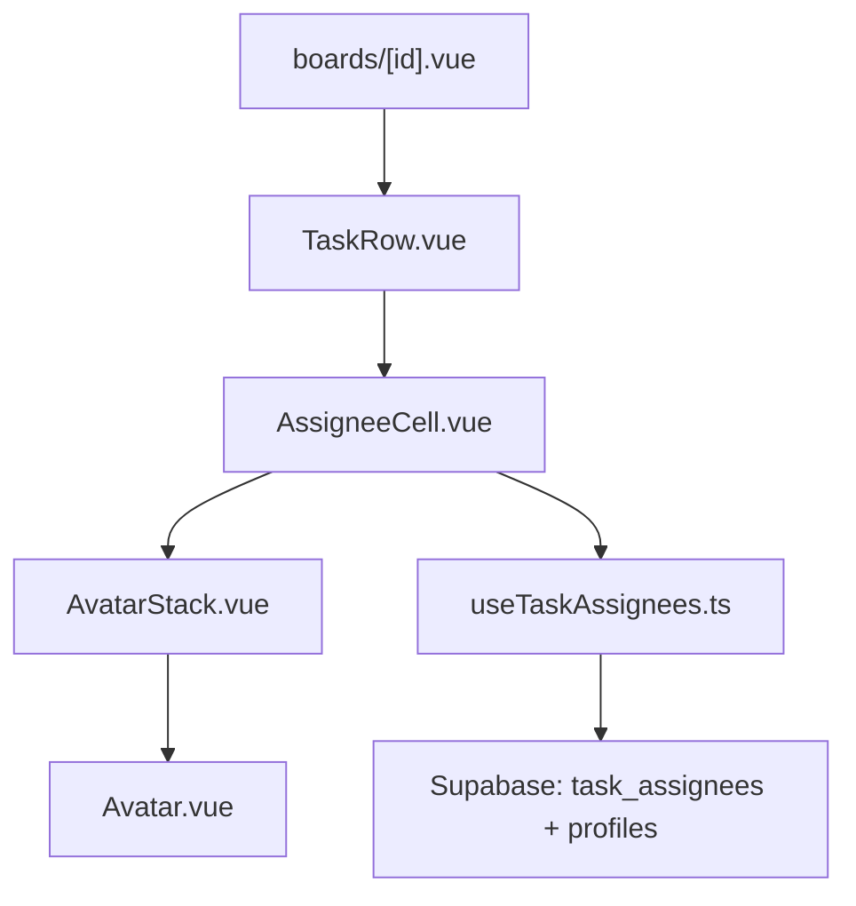

# Documento de Design — Coluna Responsável (Assignee Column)

## Visão Geral

Este documento descreve o design técnico para a feature **task-assignee-column**, que implementa a exibição padronizada de responsáveis na linha de tarefa do board.

A feature introduz três novos componentes Vue (`TaskRow`, `AssigneeCell`, `AvatarStack`/`Avatar`) e um composable (`useTaskAssignees`). O componente `TaskRow` serve como base extensível para as demais colunas do board em fases futuras.

---

## Arquitetura



**Fluxo de dados:**
1. `boards/[id].vue` renderiza um `TaskRow` por tarefa dentro de cada grupo.
2. `TaskRow` recebe a prop `task` e delega a renderização da coluna de responsável ao `AssigneeCell`.
3. `AssigneeCell` usa o composable `useTaskAssignees(taskId)` para buscar os responsáveis.
4. Os dados retornados alimentam o `AvatarStack`, que renderiza os `Avatar`s individualmente.

**Decisão de design:** O composable `useTaskAssignees` faz a busca por `task_id` individualmente (não em batch) nesta fase, mantendo simplicidade. Otimização para batch pode ser feita em fase futura quando o número de tarefas visíveis justificar.

---

## Componentes e Interfaces

### `TaskRow.vue`

Componente de linha de tarefa. Ponto de entrada para todas as colunas do board.

```typescript
// Props
interface TaskRowProps {
  task: {
    id: string
    title: string
    group_id: string | null
    board_id: string
    status_id: string | null
    priority_id: string | null
    due_date: string | null
  }
}
```

Layout: linha horizontal com `flex`, onde cada coluna ocupa um slot fixo. Nesta fase, apenas o título e a coluna de responsável são renderizados.

---

### `AssigneeCell.vue`

Coluna de responsável dentro do `TaskRow`. Orquestra a busca de dados e delega a renderização ao `AvatarStack`.

```typescript
// Props
interface AssigneeCellProps {
  taskId: string
}
```

Responsabilidades:
- Chamar `useTaskAssignees(taskId)` para obter a lista de responsáveis.
- Renderizar `AvatarStack` quando há responsáveis.
- Renderizar o estado vazio (ícone neutro) quando a lista está vazia.
- Exibir um skeleton/loading enquanto `loading === true`.

---

### `AvatarStack.vue`

Exibe uma pilha de avatares sobrepostos. Lida com a lógica de truncamento (máx. 3 visíveis + contador).

```typescript
// Props
interface AvatarStackProps {
  assignees: AssigneeProfile[]
  maxVisible?: number  // padrão: 3
}
```

Lógica de truncamento:
- Se `assignees.length <= maxVisible`: renderiza todos.
- Se `assignees.length > maxVisible`: renderiza os primeiros `maxVisible` e um badge `+N`.

O `title` do elemento raiz contém os nomes completos de todos os responsáveis (tooltip nativo).

---

### `Avatar.vue`

Renderiza o avatar de um único usuário.

```typescript
// Props
interface AvatarProps {
  profile: AssigneeProfile
  size?: 'sm' | 'md'  // padrão: 'sm' (24px)
}
```

Lógica de fallback (em ordem de prioridade):
1. Se `avatar_url` não é nulo → renderiza `` com `src=avatar_url`, `alt=full_name`, `title=full_name`.
2. Se `avatar_url` é nulo e `full_name` não é nulo → renderiza iniciais do `full_name` (ex: "João Silva" → "JS").
3. Se `avatar_url` e `full_name` são nulos → renderiza iniciais do `email` (ex: "joao@empresa.com" → "JO").

Tamanhos:
- `sm`: `w-6 h-6` (24px) — padrão para uso no board.
- `md`: `w-8 h-8` (32px) — para uso em contextos maiores.

---

## Modelos de Dados

### `AssigneeProfile`

Tipo compartilhado que representa um responsável com dados de perfil.

```typescript
// shared/types/assignee.ts
export interface AssigneeProfile {
  id: string
  full_name: string | null
  email: string
  avatar_url: string | null
}
```

Este tipo é derivado da tabela `profiles` e é o contrato entre o composable e os componentes de UI.

---

### `useTaskAssignees`

```typescript
// Retorno do composable
interface UseTaskAssigneesReturn {
  assignees: Ref<AssigneeProfile[]>
  loading: Ref<boolean>
  error: Ref<string | null>
  fetchAssignees: (taskId: string) => Promise<void>
}
```

**Query Supabase:**
```typescript
supabase
  .from('task_assignees')
  .select(`
    user_id,
    profiles:user_id (
      id,
      full_name,
      email,
      avatar_url
    )
  `)
  .eq('task_id', taskId)
```

A query usa join implícito via FK `task_assignees.user_id → profiles.id`, respeitando o contrato canônico do banco.

---

## Propriedades de Corretude

*Uma propriedade é uma característica ou comportamento que deve ser verdadeiro em todas as execuções válidas do sistema — essencialmente, uma declaração formal sobre o que o sistema deve fazer. Propriedades servem como ponte entre especificações legíveis por humanos e garantias de corretude verificáveis por máquina.*

---

**Propriedade 1: Avatares renderizados para todos os responsáveis (≤ maxVisible)**

*Para qualquer* lista de responsáveis com tamanho entre 1 e `maxVisible` (padrão 3), o `AvatarStack` deve renderizar exatamente N elementos de avatar no DOM.

**Valida: Requisitos 1.1, 2.1**

---

**Propriedade 2: Truncamento correto para listas grandes**

*Para qualquer* lista de responsáveis com tamanho N > `maxVisible`, o `AvatarStack` deve renderizar exatamente `maxVisible` avatares e um elemento de contador com o valor `N - maxVisible`.

**Valida: Requisito 2.2**

---

**Propriedade 3: Fallback de iniciais para avatar ausente**

*Para qualquer* perfil onde `avatar_url` é nulo, o componente `Avatar` deve renderizar um elemento de texto contendo as iniciais derivadas de `full_name` (quando disponível) ou de `email` (quando `full_name` é nulo), e não deve renderizar uma tag ``.

**Valida: Requisitos 1.4, 1.5**

---

**Propriedade 4: Atributos de acessibilidade no Avatar com imagem**

*Para qualquer* perfil onde `avatar_url` não é nulo, o componente `Avatar` deve renderizar uma tag `` com atributo `alt` não vazio contendo o nome do responsável e atributo `title` com o nome completo.

**Valida: Requisitos 1.3, 5.1, 5.2**

---

**Propriedade 5: Tooltip do AvatarStack contém todos os nomes**

*Para qualquer* lista de responsáveis, o elemento raiz do `AvatarStack` deve possuir um atributo `title` cujo conteúdo inclui o nome (full_name ou email) de cada responsável da lista.

**Valida: Requisito 2.3**

---

**Propriedade 6: Invariante de campos do composable**

*Para qualquer* `task_id` válido, todos os objetos retornados pelo `useTaskAssignees` no array `assignees` devem possuir os campos `id`, `email`, `full_name` e `avatar_url` (sendo `full_name` e `avatar_url` anuláveis, mas `id` e `email` sempre presentes).

**Valida: Requisitos 3.1, 3.3**

---

**Propriedade 7: Estado de loading do composable**

*Para qualquer* chamada a `fetchAssignees`, a propriedade `loading` deve ser `true` durante a execução da busca e `false` após a conclusão (com sucesso ou erro).

**Valida: Requisito 3.5**

---

**Propriedade 8: TaskRow renderiza título e AssigneeCell juntos**

*Para qualquer* tarefa com título e lista de responsáveis, o `TaskRow` renderizado deve conter tanto o texto do título quanto o componente `AssigneeCell` no mesmo elemento de linha.

**Valida: Requisitos 4.2, 4.3**

---

## Tratamento de Erros

| Situação | Comportamento |
|---|---|
| `avatar_url` nulo | Fallback para iniciais de `full_name` |
| `full_name` nulo | Fallback para iniciais de `email` |
| Erro na busca Supabase | `error` reativo preenchido; `assignees` permanece `[]`; nenhuma exceção lançada |
| `task_id` inválido/inexistente | Retorna array vazio sem erro |
| Imagem de avatar com URL quebrada | Evento `onerror` na `` aciona fallback para iniciais |

O componente `AssigneeCell` deve tratar o estado de erro exibindo o estado vazio (sem mensagem de erro visível ao usuário final, pois a ausência de responsável é um estado válido).

---

## Estratégia de Testes

### Abordagem Dual

Os testes são divididos em dois tipos complementares:

**Testes unitários** — verificam exemplos específicos, casos de borda e condições de erro:
- `Avatar` com `avatar_url` válido renderiza `` corretamente.
- `Avatar` com `avatar_url` nulo e `full_name` "João Silva" renderiza "JS".
- `Avatar` com `avatar_url` nulo e `full_name` nulo e `email` "joao@empresa.com" renderiza "JO".
- `AssigneeCell` com lista vazia renderiza o placeholder de estado vazio.
- `useTaskAssignees` com erro de rede preenche `error` e não lança exceção.

**Testes de propriedade** — verificam propriedades universais com entradas geradas aleatoriamente:
- Cada propriedade listada na seção anterior deve ser implementada como um teste de propriedade.
- Biblioteca recomendada: **`fast-check`** (compatível com Vitest/Jest, amplamente usada em projetos TypeScript/Vue).
- Configuração mínima: **100 iterações** por teste de propriedade.
- Cada teste deve referenciar a propriedade do design com o formato:
  `// Feature: task-assignee-column, Propriedade N: <texto da propriedade>`

### Configuração de Testes de Propriedade

```typescript
// Exemplo de estrutura de teste de propriedade com fast-check + Vitest
import fc from 'fast-check'
import { describe, it, expect } from 'vitest'

describe('AvatarStack', () => {
  it('Propriedade 1: renderiza N avatares para listas com N <= maxVisible', () => {
    // Feature: task-assignee-column, Propriedade 1: Avatares renderizados para todos os responsáveis
    fc.assert(
      fc.property(
        fc.array(arbitraryAssigneeProfile(), { minLength: 1, maxLength: 3 }),
        (assignees) => {
          // montar componente e verificar contagem de avatares
        }
      ),
      { numRuns: 100 }
    )
  })
})
```

### Cobertura Esperada

| Componente/Composable | Tipo de Teste | Propriedades Cobertas |
|---|---|---|
| `Avatar` | Propriedade + Unitário | P3, P4 + edge-cases de fallback |
| `AvatarStack` | Propriedade | P1, P2, P5 |
| `AssigneeCell` | Unitário | Estado vazio, loading, erro |
| `useTaskAssignees` | Propriedade + Unitário | P6, P7 + erro de rede |
| `TaskRow` | Propriedade + Exemplo | P8 + integração com AssigneeCell |
