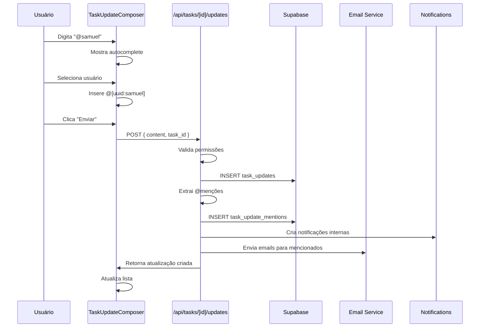
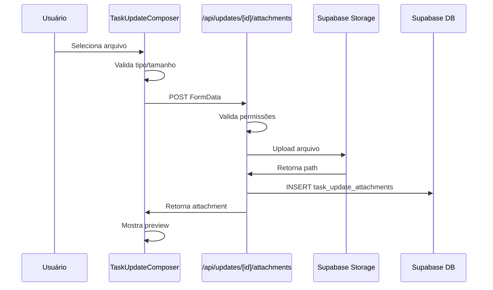
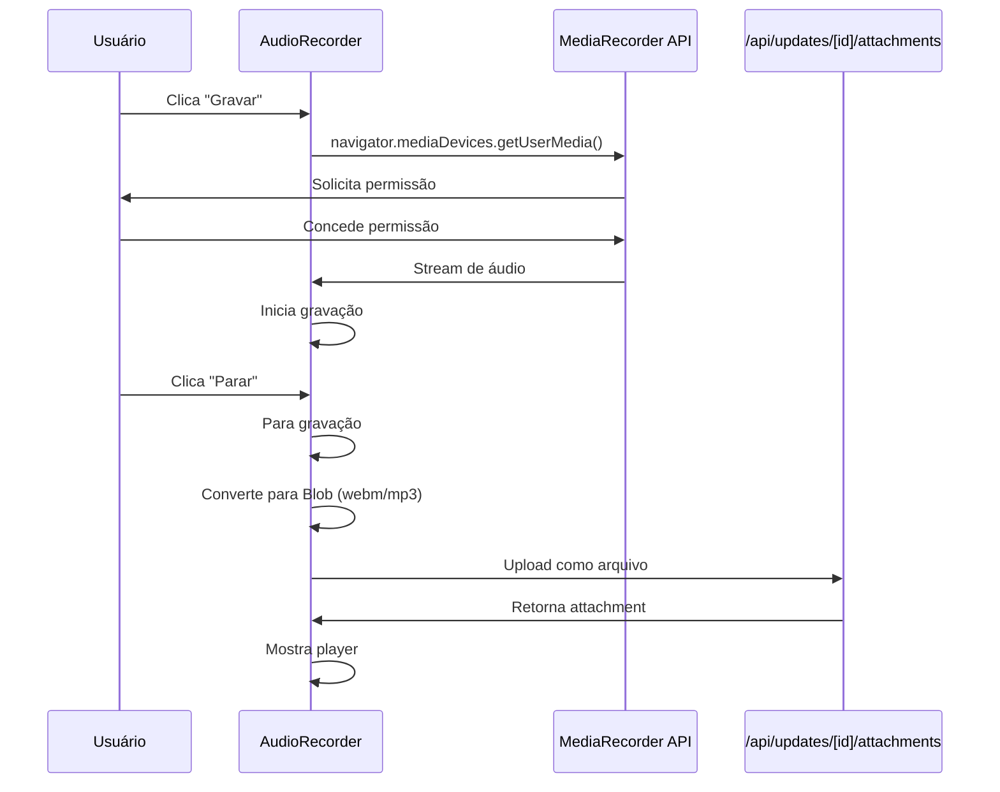

# Design do Sistema de Atualizações

## Arquitetura

### Camadas

```
┌─────────────────────────────────────────────────────────────┐
│                      FRONTEND (Vue 3)                        │
├─────────────────────────────────────────────────────────────┤
│  Components:                                                 │
│  - LastUpdatedCell.vue (coluna no board)                    │
│  - TaskUpdatesModal.vue (modal principal)                   │
│  - TaskUpdateCard.vue (card de atualização)                 │
│  - TaskUpdateComposer.vue (criar atualização)               │
│  - MentionInput.vue (input com @autocomplete)               │
│  - AudioRecorder.vue (gravar áudio)                         │
│  - AudioPlayer.vue (tocar áudio)                            │
│                                                              │
│  Composables:                                                │
│  - useTaskUpdates.ts (CRUD)                                 │
│  - useMentions.ts (@menções)                                │
│  - useAttachments.ts (arquivos)                             │
│  - useAudioRecorder.ts (gravação)                           │
├─────────────────────────────────────────────────────────────┤
│                    API LAYER (Nuxt Server)                   │
├─────────────────────────────────────────────────────────────┤
│  Endpoints:                                                  │
│  - POST /api/tasks/[id]/updates (criar)                     │
│  - GET /api/tasks/[id]/updates (listar)                     │
│  - POST /api/updates/[id]/reply (responder)                 │
│  - POST /api/updates/[id]/like (curtir)                     │
│  - POST /api/updates/[id]/attachments (upload)              │
│  - POST /api/updates/[id]/mark-read (marcar lida)           │
│                                                              │
│  Utils:                                                      │
│  - extractMentions() (extrair @menções)                     │
│  - sendMentionEmail() (enviar email)                        │
│  - createNotification() (notificação interna)               │
├─────────────────────────────────────────────────────────────┤
│                   DATABASE (Supabase)                        │
├─────────────────────────────────────────────────────────────┤
│  Tables:                                                     │
│  - task_updates (atualizações)                              │
│  - task_update_attachments (anexos)                         │
│  - task_update_mentions (menções)                           │
│  - task_update_likes (curtidas)                             │
│  - task_update_reads (leituras)                             │
│  - notifications (notificações internas)                    │
│                                                              │
│  Storage:                                                    │
│  - task-update-attachments bucket                           │
└─────────────────────────────────────────────────────────────┘
```

## Estrutura de Dados

### task_updates
```typescript
interface TaskUpdate {
  id: string
  task_id: string
  author_id: string
  content: string // texto com @menções no formato @[user_id:nome]
  parent_id: string | null // para respostas
  created_at: string
  updated_at: string
  edited_at: string | null
  
  // Relações (via join)
  author: Profile
  attachments: TaskUpdateAttachment[]
  mentions: TaskUpdateMention[]
  likes: TaskUpdateLike[]
  replies: TaskUpdate[]
  reply_count: number
  like_count: number
  is_liked_by_me: boolean
  is_read_by_me: boolean
}
```

### task_update_attachments
```typescript
interface TaskUpdateAttachment {
  id: string
  update_id: string
  file_name: string
  file_path: string
  mime_type: string
  size_bytes: number
  attachment_type: 'file' | 'audio' | 'image'
  uploaded_by: string
  created_at: string
  
  // Computed
  download_url: string
  preview_url?: string // para imagens
}
```

### task_update_mentions
```typescript
interface TaskUpdateMention {
  id: string
  update_id: string
  mentioned_user_id: string
  created_at: string
  
  // Relação
  mentioned_user: Profile
}
```

## Fluxos Detalhados

### 1. Criar Atualização com Menção



### 2. Upload de Arquivo



### 3. Gravação de Áudio



## Design de Interface

### LastUpdatedCell (Coluna no Board)

```
┌─────────────────────────────────┐
│ 🕐 2h atrás                      │
│ @samuel mencionou você           │
│ [Ver 3 atualizações]             │
└─────────────────────────────────┘
```

**Estados:**
- Sem atualizações: "Sem atualizações"
- Com atualizações não lidas: Badge vermelho com contador
- Hover: Destaque sutil

### TaskUpdatesModal

```
┌──────────────────────────────────────────────────────────────┐
│  Atualizações da Tarefa                                   [X] │
├──────────────────────────────────────────────────────────────┤
│  [Atualizações] [Arquivos] [Atividades]                      │
├──────────────────────────────────────────────────────────────┤
│                                                               │
│  ┌────────────────────────────────────────────────────────┐  │
│  │ 📝 Escreva uma atualização...                          │  │
│  │                                                         │  │
│  │ [@] [📎] [🎤]                          [Enviar]        │  │
│  └────────────────────────────────────────────────────────┘  │
│                                                               │
│  ┌────────────────────────────────────────────────────────┐  │
│  │ 👤 Samuel Tarif                          Agora mesmo    │  │
│  │                                                         │  │
│  │ @skolcodm fez a cotação?                               │  │
│  │                                                         │  │
│  │ 📎 cotacao.pdf (245 KB)                                │  │
│  │                                                         │  │
│  │ 👍 2  💬 1                    [Curtir] [Responder]     │  │
│  │                                                         │  │
│  │   └─ 👤 João Silva                      1h atrás       │  │
│  │      Sim, já enviei!                                   │  │
│  └────────────────────────────────────────────────────────┘  │
│                                                               │
│  ┌────────────────────────────────────────────────────────┐  │
│  │ 👤 Maria Santos                         2h atrás       │  │
│  │                                                         │  │
│  │ Iniciando o projeto hoje                               │  │
│  │                                                         │  │
│  │ 👍 5                          [Curtir] [Responder]     │  │
│  └────────────────────────────────────────────────────────┘  │
│                                                               │
└──────────────────────────────────────────────────────────────┘
```

### TaskUpdateComposer (Campo de Criação)

```
┌────────────────────────────────────────────────────────┐
│ 📝 Escreva uma atualização...                          │
│                                                         │
│ @samuel, você pode revisar?                            │
│                                                         │
│ ┌─────────────────────────────────────────────────┐   │
│ │ @samuel (samuel.tarif@gmail.com)                │   │ <- Autocomplete
│ │ @skolcodm (skolcodm@gmail.com)                  │   │
│ └─────────────────────────────────────────────────┘   │
│                                                         │
│ [📎 Anexar] [🎤 Gravar áudio]          [Enviar]       │
└────────────────────────────────────────────────────────┘
```

### AudioRecorder

```
┌────────────────────────────────────────────────────────┐
│ 🎤 Gravando áudio...                          00:15    │
│                                                         │
│ ▓▓▓▓▓▓▓▓▓▓▓▓▓▓▓▓▓▓▓▓▓▓▓▓▓▓▓▓▓▓▓▓▓▓▓▓▓▓▓▓▓▓▓▓▓▓▓▓▓▓▓▓  │ <- Waveform
│                                                         │
│              [⏸️ Pausar] [⏹️ Parar]                     │
└────────────────────────────────────────────────────────┘
```

### AudioPlayer

```
┌────────────────────────────────────────────────────────┐
│ 🎵 audio-2024-04-13.webm                               │
│                                                         │
│ [▶️] ━━━━━━━━━━━━━━━━━━━━━━━━━━━━━━━━━━━━━━━━━━━━━━ │
│      00:15 / 01:23                                     │
│                                                         │
│ [⬇️ Download]                                          │
└────────────────────────────────────────────────────────┘
```

## Tokens de Design

### Cores
```css
--update-bg: #ffffff
--update-border: #e5e7eb
--update-hover: #f9fafb
--mention-color: #6366f1
--mention-bg: #eef2ff
--like-color: #ef4444
--reply-border: #d1d5db
--timestamp-color: #6b7280
```

### Espaçamentos
```css
--update-padding: 16px
--update-gap: 12px
--reply-indent: 40px
--avatar-size: 40px
```

### Tipografia
```css
--update-font-size: 14px
--update-line-height: 1.5
--timestamp-font-size: 12px
--mention-font-weight: 600
```

## Padrões de Código

### Formato de Menção no Texto
```typescript
// Armazenado no banco:
"@[uuid-123:Samuel Tarif] fez a cotação?"

// Renderizado no frontend:
"<span class='mention'>@Samuel Tarif</span> fez a cotação?"
```

### Extração de Menções (Backend)
```typescript
function extractMentions(content: string): string[] {
  const mentionRegex = /@\[([a-f0-9-]+):[^\]]+\]/g
  const matches = content.matchAll(mentionRegex)
  return Array.from(matches, m => m[1]) // retorna array de UUIDs
}
```

### Renderização de Menções (Frontend)
```typescript
function renderMentions(content: string): string {
  return content.replace(
    /@\[([a-f0-9-]+):([^\]]+)\]/g,
    '<span class="mention" data-user-id="$1">@$2</span>'
  )
}
```

## Performance

### Otimizações
1. **Paginação**: Carregar 20 atualizações por vez
2. **Lazy Loading**: Carregar respostas sob demanda
3. **Debounce**: Autocomplete de menções com 300ms
4. **Caching**: Cache de membros do board
5. **Optimistic Updates**: Atualizar UI antes da resposta do servidor

### Limites
- Máximo 10 menções por atualização
- Máximo 5 anexos por atualização
- Tamanho máximo de arquivo: 10MB
- Duração máxima de áudio: 5 minutos
- Rate limit: 10 atualizações por minuto

## Acessibilidade

- Usar `aria-label` em botões de ação
- Suporte a navegação por teclado
- Anunciar novas atualizações com `aria-live`
- Contraste adequado para menções
- Alt text para imagens anexadas

## Testes

### Unitários
- Extração de menções
- Renderização de menções
- Validação de arquivos
- Formatação de timestamps

### Integração
- Criar atualização com menção
- Upload de arquivo
- Gravação de áudio
- Curtir/descurtir
- Responder atualização

### E2E
- Fluxo completo: criar atualização → mencionar → receber notificação
- Fluxo de áudio: gravar → enviar → reproduzir
- Fluxo de thread: criar → responder → visualizar
